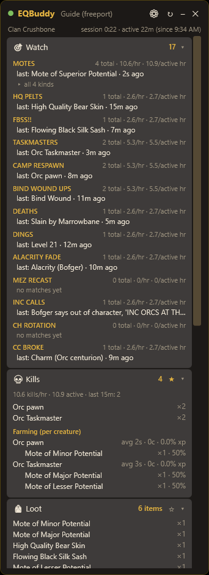
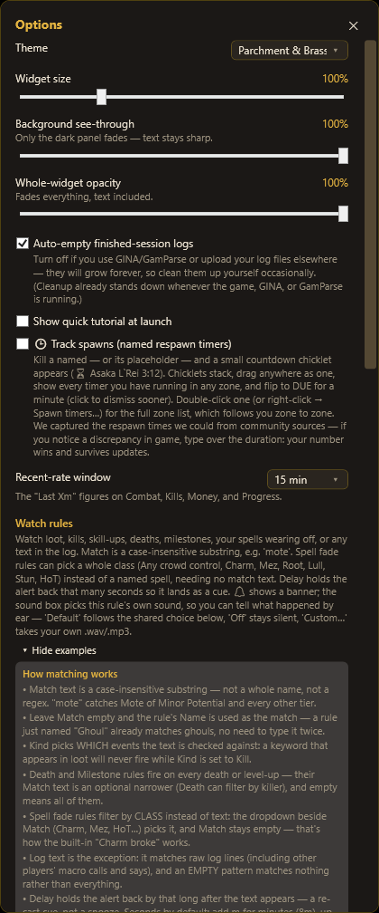
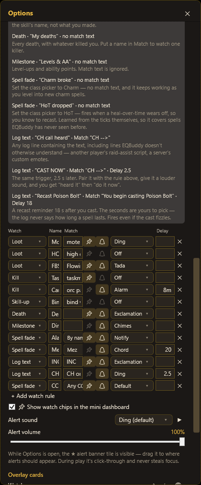
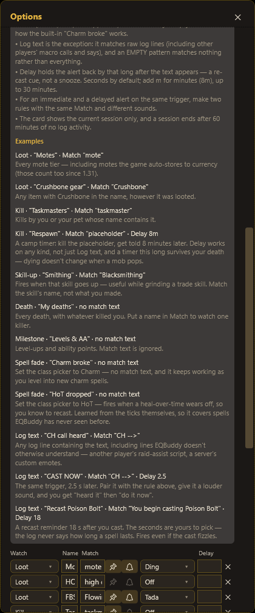

# The Watch List, in full

The Watch List is EQBuddy's most flexible feature: you tell it what matters to you —
an item, a mob, a skill, a spell wearing off, even a raw line of chat — and it counts
it, timestamps it, shows it on the widget, and (if you want) plays a sound or flashes
a banner the moment it happens. Every rule is one row: no scripting, no regex.

This guide walks the whole feature: how matching works, every rule kind with real
use-cases, cue timers, sounds, and the mini-dashboard chips. Everything below was
captured from a live widget.

## Where things live

- **Create and edit rules**: ⚙ gear menu → **Options…** → **Watch rules**.
- **See results**: the 🎯 **Watch** card on the widget — one row per rule, with a
  running count, rate per hour, and a "last: …" line showing the most recent match.
  Click **▸ all N kinds** under a rule to expand the per-item breakdown.
- **Get alerted**: each rule can flash the ★ **alert banner tile** and/or play a
  sound. While Options is open, the banner tile is visible — drag it to where you
  want alerts to appear. In play it's click-through and never steals focus.
- **Glance while fighting**: pinned rules (📌) become chips in the **mini dashboard**
  when you minimize the widget.

## How matching works

The full rules are in the Options panel itself (screenshot below), but the essentials:

1. **Match text is a case-insensitive substring** — not a whole name, not a regex.
   `mote` catches *Mote of Minor Potential* and every other tier.
2. **Empty Match uses the rule's Name** — a rule just named "Ghoul" already matches.
3. **Kind picks what the text is checked against** — the #1 gotcha: a loot keyword
   will never fire while Kind is set to Kill.
4. **Death and Milestone rules fire on everything** by default; their Match is an
   optional narrower (Death can filter by killer name).
5. **Spell fade rules can filter by class** instead of text — the dropdown beside
   Match (Charm, Mez, HoT…) — and then need no match text at all.
6. **Log text is the exception**: it matches raw log lines, and an empty pattern
   matches *nothing* (imagine alerting on every line).
7. **Delay turns a rule into a cue**: the count updates immediately, but the banner
   and sound arrive N seconds later. Seconds by default, `8m` style for minutes,
   up to 30 minutes.

## The rule kinds, with use-cases

The editor row for each rule: Kind · Name · Match · 📌 pin · 🔔 banner · sound ·
Delay · ✕ delete.

### Loot — "did the thing drop?"

Matches item names as you loot them — including loot the game auto-sells from the
corpse and loot it **auto-stores** (motes to currency, pelts to the tradeskill
depot; those count since 1.31).

| Use-case | Name | Match | Extras |
|---|---|---|---|
| All motes, any tier | Motes | `mote` | 🔔 + Ding — hear every mote without looking |
| The drop you're camping | FBSS!! | `Flowing Black` | 🔔 + Tada — celebrate properly |
| Tradeskill farming | HQ pelts | `high quality` | silent — just count them |

The Watch card shows `last: Mote of Lesser Potential · 1m ago` per rule, and the
▸ expander breaks the count down by exact item ("all 3 kinds").

### Kill — "how many, and when was the last one?"

Matches creatures killed by you **or your pet**.

| Use-case | Name | Match | Extras |
|---|---|---|---|
| Named counter | Taskmasters | `taskmaster` | count + "last: 3m ago" answers "is it up soon?" |
| Camp cue | Camp respawn | `orc pawn` | Delay `8m` + Alarm — kill the placeholder, get told when to look |
| Quest tally | Gnoll fangs run | `gnoll` | silent counter for "kill 30 gnolls" style quests |

The camp-cue pattern is worth internalizing: **Kill + Delay is a respawn timer** that
works on any mob, even ones the Spawns feature doesn't know. (For named the catalog
knows, Track Spawns gives you real countdown chips instead.)

### Skill-up — "is this skill still climbing?"

Matches the skill's name when it goes up — not what you made or hit.

| Use-case | Name | Match | Extras |
|---|---|---|---|
| Grinding a tradeskill | Smithing | `Blacksmithing` | rate/hr tells you if the grind is working |
| Weapon skill catch-up | 1HS ups | `1H Slashing` | "last: 14m ago" = time to lower your defense |
| Everything | Any skill | *(empty Name trick doesn't apply here — use a broad match)* | |

### Death — "what keeps killing me?"

Fires on every death with empty Match; put a name in Match to watch one killer.

| Use-case | Name | Match | Extras |
|---|---|---|---|
| All deaths | Deaths | *(empty)* | 🔔 + sound — also timestamps for corpse runs |
| One nemesis | Marrowbane deaths | `Marrowbane` | how much is that camp really costing you? |

### Milestone — "levels and AA"

Fires on level-ups and AA points; Match is ignored. One rule, silent or loud, gives
you a session tally of dings — nice with the "last: Level 21 · 12m ago" line.

### Spell fade — "my spell wore off"

Matches **your** spells wearing off targets. Two modes via the class dropdown:

- **By name** + Match: one spell. `Alacrity` → know the second your haste drops off
  the warrior.
- **A class**, no Match needed: *Charm* (the built-in "CC broke" rule — keeps working
  as you level into new charm spells), *Mez*, *Root*, *HoT* ("a heal-over-time wore
  off → recast"), *Any crowd control*, *Any spell*.

| Use-case | Config | Why |
|---|---|---|
| Charm safety net | class = Charm, no match | ships built-in; the pet turning on you is the worst surprise in the game |
| HoT uptime | class = HoT, no match | fires per target as each HoT drops — recast prompts for healers |
| Mez recast cue | class = Mez, Delay `20` | sound at 20 s ≈ "recast before it breaks" (pair with the 💤 mez chips for exact timers) |
| Specific buff | By name, `Alacrity` | keep your enchanter reputation intact |

### Log text — "alert on anything the log says"

The power tool: matches **raw log lines**, including things EQBuddy doesn't otherwise
understand — other players' macro calls, server emotes, tells, anything. Empty match
matches nothing (by design).

| Use-case | Name | Match | Extras |
|---|---|---|---|
| Raid assist calls | INC calls | `INC` | 🔔 + Exclamation |
| Heal rotation | CH call heard | `CH -->` | quiet Ding = "heard it" |
| Heal rotation, part 2 | CAST NOW | `CH -->` | Delay `2.5` + louder sound = "your turn" |
| Recast reminder | Recast Poison Bolt | `You begin casting Poison Bolt` | Delay `18` — a recast timer for any spell, since the log never says durations |
| Your name in chat | Called out | `Dranak` | never miss being addressed while tab-tunneling |

The two-rule CH pattern shows the general trick: **two rules with the same Match and
different delays/sounds** give you a quiet "heard it" and a loud "act now" — one rule
can't do both.

## Alerts, sounds, and chips

- **🔔 banner**: flashes the ★ alert tile with `Rule: match` — e.g. `Motes: Mote of
  Superior Potential`:

  

- **Per-rule sounds**: the dropdown on each row. *Default* follows the shared alert
  sound in Options, *Off* is silent, *Custom…* takes your own .wav/.mp3. Giving each
  rule its own sound is the point — you learn what happened **by ear**, without
  looking away from the fight. (Check the **Alert volume** slider if things are
  quiet — added in 1.31 along with a fix that had alerts at half volume.)
- **📌 pin**: pinned rules appear as chips in the mini dashboard when the widget is
  minimized — counts at a glance during combat.
- **Cooldowns**: a rule won't re-fire its alert in a tight loop; counts always update
  instantly regardless.

## Scope and gotchas

- The Watch card counts **the current session** — a session ends after 60 minutes of
  log silence. (Past sessions keep their tracked totals in Session history.)
- Matching is **case-insensitive** everywhere.
- The #1 support question is a Kind mismatch: a loot word under Kind=Kill matches
  nothing. Check the Kind dropdown first.
- Log-text rules see **other players' lines too** — great for raid calls, but a match
  word like `heal` will fire on enemy casts as well; pick distinctive text.
- Two rules may share a display name — they're tracked separately (each rule has an
  internal identity).

---

*Questions, ideas, or a rule pattern the guide should include? Open a
[discussion](https://github.com/DranakCorps-bot/EQBuddy/discussions) — several of the
patterns above came straight from player suggestions.*
